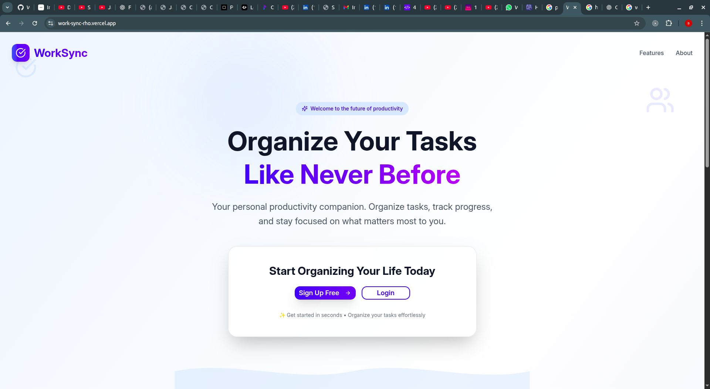
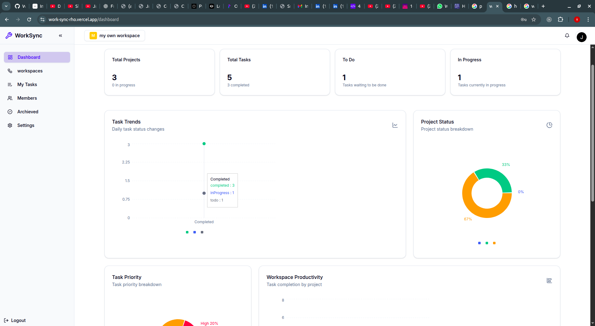
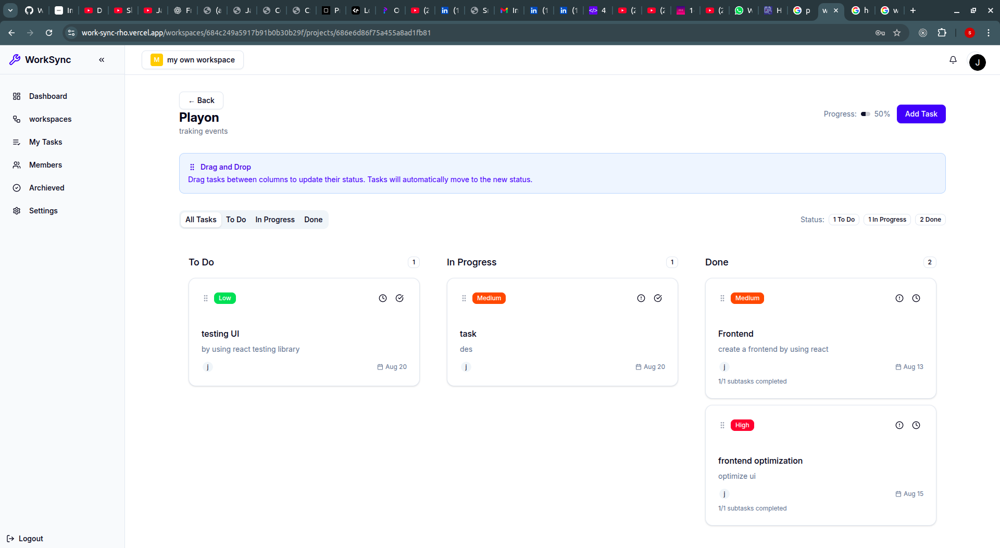
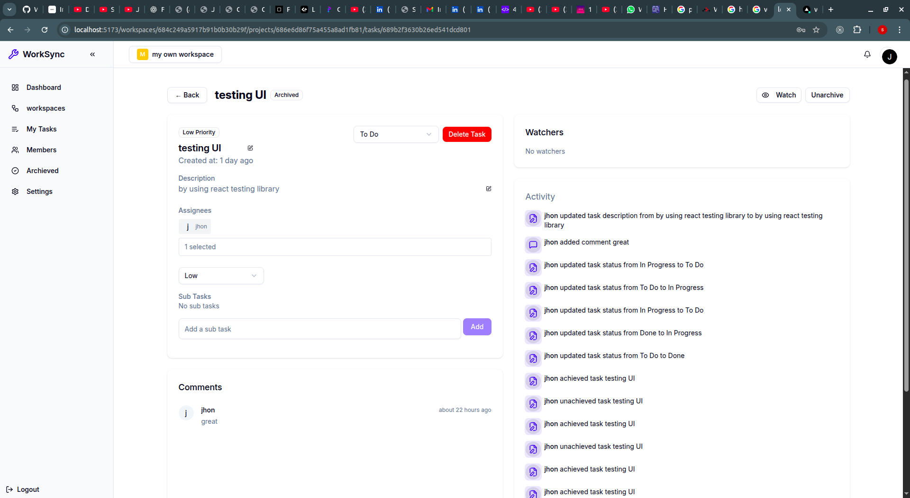

# 🚀 WorkSync - Team Collaboration & Task Management Platform

> **Streamline your productivity with intelligent task management and seamless team collaboration**


## 📋 Table of Contents

- [Overview](#overview)
- [Features](#features)
- [Tech Stack](#tech-stack)
- [Screenshots](#screenshots)
- [Getting Started](#getting-started)
- [Installation](#installation)
- [Usage](#usage)
- [Project Structure](#project-structure)
- [Contributing](#contributing)
- [License](#license)

## 🌟 Overview

WorkSync is a comprehensive project management platform designed to bring structure and efficiency to your workflow. Built with a hierarchical approach (Workspaces → Projects → Tasks), it provides the perfect balance of organization and flexibility for both personal productivity and team collaboration.

### 🎯 Key Highlights

- **Structured Organization**: Hierarchical workspace management
- **Real-time Collaboration**: Live updates, comments, and team coordination
- **Intuitive Interface**: Drag-and-drop task management with modern UI
- **Advanced Analytics**: Interactive dashboards with progress tracking
- **Cross-platform**: Responsive design that works everywhere

## ✨ Features

### 🔧 Core Functionality

- **📊 Interactive Dashboard**: Real-time project insights and progress tracking
- **📝 Advanced Task Management**: Drag-and-drop reordering, subtasks, priority setting
- **👥 Team Collaboration**: Task comments, mentions, and activity logs
- **🔐 Secure Authentication**: Multi-user access with role-based permissions
- **📈 Data Visualization**: Interactive charts for performance and timeline tracking

### 🚀 Advanced Features

- **📱 Responsive Design**: Optimized for desktop, tablet, and mobile
- **🔄 Real-time Updates**: Live synchronization across all devices
- **📋 Project Archiving**: Keep completed projects organized
- **👀 Project Watching**: Stay updated on important project changes
- **🔔 Smart Notifications**: Never miss critical updates
- **📊 Activity Logs**: Comprehensive tracking of all changes
- **💬 Comment System**: Threaded discussions on tasks and projects

## 🛠 Tech Stack

### Frontend

- **Framework**: React 19.1 with TypeScript
- **Routing**: React Router 7.5
- **Styling**: Tailwind CSS 4.1
- **UI Components**: Radix UI primitives
- **State Management**: TanStack Query for server state and Caching
- **Form Handling**: React Hook Form with Zod validation
- **Icons**: Lucide React
- **Charts**: Recharts for data visualization
- **Build Tool**: Vite 6.3

### Backend

- **Runtime**: Node.js
- **Framework**: Express.js (JavaScript)
- **Database**: MongoDB
- **Authentication**: JWT-based authentication
- **API**: RESTful API design

### Deployment & Infrastructure

- **Frontend**: Vercel (Optimized builds with code-splitting)
- **Backend**: Render
- **Performance**: Asset compression, lazy loading, optimized bundles

## 📸 Screenshots

### Landing Page


Clean, modern landing page with compelling call-to-action

### Dashboard Analytics


Comprehensive overview with real-time metrics and interactive charts

### Kanban Board


Intuitive Kanban-style task board with drag-and-drop functionality

### Task Details


Detailed task view with comments, activity logs, and collaboration features

## 🚀 Getting Started

### Prerequisites

- Node.js (v18 or higher)
- npm or yarn
- MongoDB (local or cloud instance)

### Installation

1. **Clone the repository**

   ```bash
   git clone https://github.com/Sreekanth3737/worksync.git
   cd worksync
   ```

2. **Install frontend dependencies**

   ```bash
   cd frontend
   npm install
   ```

3. **Install backend dependencies**

   ```bash
   cd ../backend
   npm install
   ```

4. **Environment Setup**

   Create `.env` files in both frontend and backend directories:

   **Frontend (.env)**

   ```env
   VITE_API_URL=http://localhost:5000/api
   VITE_APP_URL=http://localhost:5173
   ```

   **Backend (.env)**

   ```env
   PORT=5000
   MONGODB_URI=mongodb://localhost:27017/worksync
   JWT_SECRET=your_jwt_secret_key
   CORS_ORIGIN=http://localhost:5173
   ```

5. **Start the development servers**

   **Backend (Terminal 1)**

   ```bash
   cd backend
   npm run dev
   ```

   **Frontend (Terminal 2)**

   ```bash
   cd frontend
   npm run dev
   ```

6. **Open your browser**
   ```
   Frontend: http://localhost:5173
   Backend API: http://localhost:5000
   ```

## 📖 Usage

### Creating Your First Workspace

1. Sign up or log in to your WorkSync account
2. Create a new workspace from the dashboard
3. Add team members by sending invitations
4. Start creating projects and organizing tasks

### Task Management

- **Create Tasks**: Use the "Add Task" button in any project
- **Organize**: Drag and drop tasks between columns (To Do, In Progress, Done)
- **Collaborate**: Add comments, mention team members, and track activity
- **Monitor**: View progress through interactive charts and analytics

### Team Collaboration

- **Invite Members**: Add team members to workspaces and projects
- **Assign Tasks**: Delegate tasks to specific team members
- **Track Progress**: Monitor team productivity through dashboard analytics
- **Communicate**: Use comments and mentions for seamless communication

## 🏗 Project Structure

```
worksync/
├── frontend/
│   ├── src/
│   │   ├── components/       # Reusable UI components
│   │   ├── pages/           # Route components
│   │   ├── hooks/           # Custom React hooks
│   │   ├── lib/             # Utility functions and configs
│   │   ├── types/           # TypeScript type definitions
│   │   └── styles/          # Global styles and Tailwind config
│   ├── public/              # Static assets
│   └── package.json
├── backend/
│   ├── controllers/         # Request handlers (JavaScript)
│   ├── models/              # Database models (JavaScript)
│   ├── routes/              # API routes (JavaScript)
│   ├── middleware/          # Custom middleware (JavaScript)
│   ├── utils/               # Helper functions (JavaScript)
│   └── package.json
└── README.md
```

## 🔧 Available Scripts

### Frontend

```bash
npm run dev          # Start development server
npm run build        # Build for production
npm run start        # Start production server
npm run typecheck    # Run TypeScript checks
npm run build:clean  # Clean build and rebuild
```

### Backend

```bash
npm run dev          # Start development server with nodemon
npm run start        # Start production server
```

## 🤝 Contributing

We welcome contributions to WorkSync! Here's how you can help:

### How to Contribute

1. **Fork the repository**
2. **Create a feature branch**
   ```bash
   git checkout -b feature/amazing-feature
   ```
3. **Make your changes**
4. **Commit your changes**
   ```bash
   git commit -m 'Add some amazing feature'
   ```
5. **Push to the branch**
   ```bash
   git push origin feature/amazing-feature
   ```
6. **Open a Pull Request**

### Development Guidelines

- Follow JavaScript/TypeScript best practices
- Write meaningful commit messages
- Update documentation as needed
- Follow the existing code style

## 📈 Performance Optimizations

WorkSync is built with performance in mind:

- **Code Splitting**: Automatic route-based code splitting
- **Asset Optimization**: Compressed images and minified assets
- **Lazy Loading**: Components loaded on demand
- **Caching**: Efficient API response caching with TanStack Query
- **Bundle Analysis**: Built-in bundle analyzer for optimization insights

## 🔒 Security Features

- **JWT Authentication**: Secure token-based authentication
- **Input Validation**: Comprehensive input validation with Zod
- **CORS Protection**: Configured CORS for API security
- **Data Sanitization**: Prevention of XSS and injection attacks

## 🌐 Browser Support

WorkSync supports all modern browsers:

- Chrome (latest)
- Firefox (latest)
- Safari (latest)
- Edge (latest)

## 📊 Analytics & Monitoring

Track your productivity with built-in analytics:

- Task completion rates
- Project progress tracking
- Team performance metrics
- Time-based activity analysis

## 🚀 Deployment

### Frontend (Vercel)

```bash
npm run build
# Deploy to Vercel
```

### Backend (Render)

```bash
# Deploy JavaScript backend to Render
```

## 📝 License

This project is licensed under the MIT License - see the [LICENSE](LICENSE) file for details.

## 🙏 Acknowledgments

- Built with ❤️ using React and modern web technologies
- UI components powered by Radix UI
- Icons provided by Lucide React
- Charts and analytics by Recharts

## 📞 Support

Need help? We're here for you:

- 📧 Email: support@worksync.dev
- 🐛 Issues: [GitHub Issues](https://github.com/Sreekanth3737/worksync/issues)
- 📖 Documentation: [docs.worksync.dev](https://docs.worksync.dev)

---

<div align="center">

**[⬆ Back to Top](#-worksync---team-collaboration--task-management-platform)**

Made with ❤️ by [Sreekanth3737](https://github.com/Sreekanth3737)

[](https://github.com/Sreekanth3737/worksync/stargazers)
[](https://github.com/Sreekanth3737/worksync/network)

</div>
